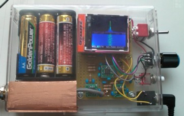
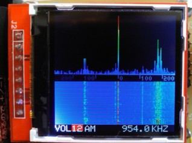
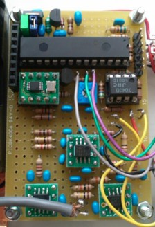
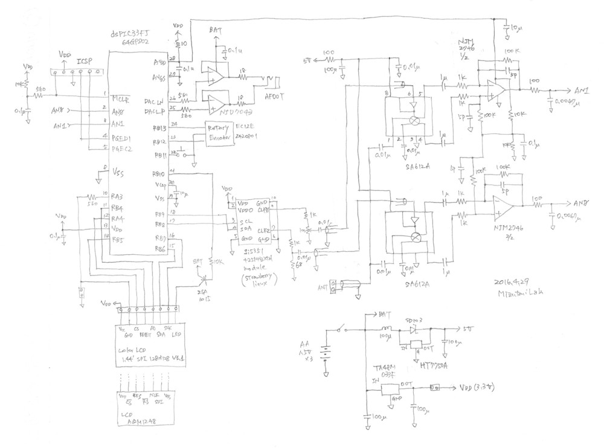
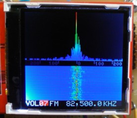
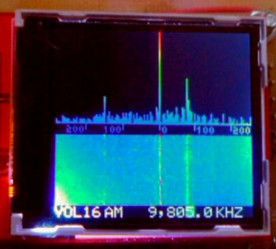

## <a href="https://github.com/mizutanilab/SDR-X">Portable and standalone SDR covering AM/FM bands</a>
ポータブルでスタンドアローンなソフトウェアラジオの製作例です。局発にSi5351Aを使ってミキサ612に入れる構成で、周波数的にはAM帯からFM帯までカバーしています。回路は、うまくいった[AD9851+SA612構成のSDR](https://github.com/mizutanilab/SDR-V3)を元にしたのですが、性能的にはそこまでいってません。カラー液晶でスペクトル（スペクトラム）が出て、ウォーターフォール表示できて、見かけだけはいい感じです。

 
全体像です。右側のプッシュボタンとツマミで周波数とか変更します。周波数は、一応19.6 kHzから225 MHzまで最小0.1 kHz刻みで設定できます。国内のAM局やFM局が聞けます。海外の短波放送も入りますが、そっちが目的なら<a href="https://github.com/mizutanilab/SDR-V3">AD9851採用のSDR</a>の方がずっといいと思います。高い方は、110 MHzまでは普通です。それ以上は局発の設定の仕方が変わって、散発的に大きいのが入ったりして何かおかしいですが、ところどころでそれらしい入感があります。低い方は26.3 kHzより下は変で、局発がついていっていない感じです。  
　今回の局発は方形波なので、1/3fや1/5fなどの奇数分の１のところでも同調します。偶数分の１のところでも若干入ります。そのせいで長波帯にはAMのゴーストが出ます。短波帯もFMのゴーストがあちこちで出ます。  
　銅色の部分は前作で貼った銅箔です。中では同軸でコネクタに配線しているだけで、何も入っていません。全体を秋月の樹脂ケースに入れて、大きさはおよそ横115 mm、縦80 mm、厚25 mmです。 

 
液晶表示です。eBayで買った350円の中華カラー液晶を使いました。上半分が周波数スペクトルです。横１ピクセルが4.16 kHz幅、スペクトル全幅は532 kHzです。中央のTBS(954 kHz)を選局しているところで、スペクトルの下に横軸をkHz単位で表示しています。左の小さいのが米軍AFN(810 kHz)で、右の強いのが文化放送(1134 kHz)です。同調から外れた両側が弱くなるのは差動増幅のカットオフ周波数からですが、この回路ではなぜかブロードにもなります。スペクトルの下はウォーターフォールです。１秒に３ラインぐらい進みます。  
　一番下の行は、左から音量（ゲイン）、復調（AMとFM）、周波数の順です。右側のプッシュボタンで、値変更（赤カーソル）と項目の移動（緑カーソル）を切り替えます。ボタンでカーソルを緑にして、ツマミでカーソルを移動させて、ゲイン・復調や選局の各桁のところに持っていって、ボタンを押すとをカーソルが赤に変わるので、そうしたらツマミで値を変更します。 

 
液晶を取ったところです。28 pinのDIPがPICで、その左下は、局発に使ったSi5351のモジュールです。その右隣にくっついているのがバックライト駆動用の2SA1015、そのさらに右がオーディオ用のNJU7043です。中央下寄りに変換基板にのっているのは差動増幅のNJM2746、一番下に２つあるのがSA612Aです。左上は電源関係です。初めは下半分をシールドしようと思って、そのスペースも作ってあったのですが、あんまりな性能でやめました。 

### 回路図

　回路は[AD9851+SA612構成のSDR](https://github.com/mizutanilab/SDR-V3)を元にしました。局発には、Silicon LabのSi5351Aが周波数範囲が広く、出力も３つあって位相が変えられそうだったので、これを使ってみることにしました。秋月のデバイス単体￥150と、ストロベリーリナックスの水晶付モジュール￥900で悩みましたが、またしてもお手軽感に負けて出来合いのモジュールにしてしまいました。その方が水晶の配線が短くてノイズが少ないメリットもあるということで、納得することにしました。  
　位相ではまたちょっとハマリました。Si5351のデータシートに位相を設定できるレジスタを見つけて、それで安心して作った後に気づきましたが、計算してみると位相の可動範囲は結構小さくて、7 MHz以下では90度もずらせないことに気づきました。でも、困っていろいろ試しているうちに、変な方法が見つかり、kHz帯でも90度位相が違う波が出せるようになって、それでやっています。  
　RF前段は、実はベタアースの１石アンプを作って付けたのですが、FMの信号があまりに強くなりすぎて、取りはずしました。アンテナのBNC端子から直でミキサの612に入れています。短波帯ではゲインが足りないようですが、つけたらゴーストも強くなるので無いほうがいい感じです。ミキサはギルバートセルのSA612(NE612)を使いました。その出力をオペアンプで差動増幅しています。612の電源は4.5 V以上なので、5 Vのステップアップ電源にしていますが、これがノイズの元でやっぱり良くありません。電池が３本しかないので仕方ありません。局発は、テキトーに抵抗で分圧して250 mVぐらいにして入れてます。半固定抵抗は振幅が同じぐらいになるように調整します。  
　PICまわりは前とほとんど同じです。クロックは内部発振＋PLLを使っています。コアの動作周波数は計算上は39.936 MHzで、最大2%変動するそうです。AFアンプも、前作同様にNJU7043を使ってBTLな感じにしました。音質は普通です。ヘッドホンは左右が直列になるように結線しています。ステレオは処理速度的に無理です。トータルの消費電流は、液晶バックライト点灯時で200 mAぐらい、消灯時165 mAです。バックライトはしばらく操作しないと暗くなり、そのうち消えるようになっています。電池電圧が下がると暗くなると同時に消えます。  
　今回の材料で変わっているのは、カラー液晶です。ネットでいろいろ探して選んだのは、128x128ドットの1.44インチ液晶で、コントローラはST7735でシリアル通信です。eBayで探して買いましたが、別の部品では届かなかったこともあるので、そういうときも対処できるように、よくショップを選んだ方がいいです。初めは秋月の極小モノクロ液晶をつけていたので、それに対応した配線もあって、ファームウエアにもルーチンだけは残してあります。ミキサのSA612Aは探せば手に入ると思います。他はありふれた部品です。全部で4000円～5000円ではないでしょうか。   
2016.6.26。回路図に間違いがあります。NJM2746の100 kΩにつながる5 pFは、本当はnon-inverting入力側についています。考えれば当然ですが。  

### 使用感
以下の局を確認しています。アンテナは、BNCから1 mぐらいのビニール線をのばして窓枠に引っ掛けているだけです。周波数は設定値です。強度「FSゲイン」はピークをフルスケールに合わせた時のゲイン(VOL)の設定値で、小さいほど強い信号です。ここでいう「ゲイン」は、信号処理でのゲインで、１段階で√2倍です。「-」はフルスケールに届かない局です。
 

<table>
<tr><th>周波数(kHz)</th><th>局名</th><th>FSゲイン</th><th>聞いた感じなど</th></tr>
<tr><td>594.0</td><td>NHKラジオ第１</td><td>15</td><td>弱い</td></tr>
<tr><td>693.0</td><td>NHKラジオ第２</td><td>-</td><td>弱い</td></tr>
<tr><td>810.0</td><td>AFN</td><td>12</td><td>普通</td></tr>
<tr><td>954.0</td><td>TBSラジオ</td><td>11</td><td>強い</td></tr>
<tr><td>1134.0</td><td>文化放送</td><td>7</td><td>非常に強い</td></tr>
<tr><td>1422.0</td><td>ラジオ日本</td><td>-</td><td>弱い</td></tr>
<tr><td>3925</td><td>ラジオNIKKEI第１</td><td>12</td><td>強い</td></tr>
<tr><td>3945</td><td>ラジオNIKKEI第２</td><td>16</td><td>普通</td></tr>
<tr><td>6003</td><td>Radio Echo of Hope</td><td>-</td><td>コリア語。弱い</td></tr>
<tr><td>6055</td><td>ラジオNIKKEI第１</td><td>15</td><td>普通</td></tr>
<tr><td>6115</td><td>ラジオNIKKEI第２</td><td>13</td><td>普通</td></tr>
<tr><td>6600</td><td>Voice of the People</td><td>-</td><td>コリア語。弱い</td></tr>
<tr><td>7275</td><td>KBS World Radio</td><td>16</td><td>コリア語</td></tr>
<tr><td>7430</td><td>China Radio International</td><td>14</td><td>中国語。このあたりでは強い</td></tr>
<tr><td>9595</td><td>ラジオNIKKEI第１</td><td>15</td><td>普通</td></tr>
<tr><td>9645</td><td>ラジオ日本（NHK国際放送）</td><td>-</td><td>早朝。なんとか聞こえる</td></tr>
<tr><td>9650</td><td>朝鮮の声放送</td><td>17</td><td>日本語</td></tr>
<tr><td>9805</td><td>KBS World Radio</td><td>16</td><td>日本語</td></tr>
<tr><td>9880</td><td>China Radio International</td><td>15</td><td>中国語</td></tr>
<tr><td>11620</td><td>China Radio International</td><td>13</td><td>英語。このあたりでは強い</td></tr>
<tr><td>11865</td><td>朝鮮の声放送</td><td>14</td><td>日本語</td></tr>
<tr><td>13570</td><td>China Radio International</td><td>15</td><td>中国語</td></tr>
<tr><td>15160</td><td>KBS World Radio</td><td>-</td><td>コリア語</td></tr>
<tr><td>15230</td><td>China Radio International</td><td>13</td><td>中国語。強い</td></tr>
<tr><td>15415</td><td>Radio Australia</td><td>-</td><td>英語。フェージング大</td></tr>
<tr><td>15480</td><td>China National Radio 1</td><td>-</td><td>中国語。弱い</td></tr>
<tr><td>15710</td><td>China National Radio 6</td><td>-</td><td>中国語。弱い</td></tr>
<tr><td>17485</td><td>Voice of America</td><td>17</td><td>中国語。弱い</td></tr>
<tr><td>17770</td><td>Radio Free Europe</td><td>-</td><td>ロシア語。ごく弱い</td></tr>
<tr><td>21695</td><td>Voice of America</td><td>16</td><td>中国語。このあたりでは強い。</td></tr>
<tr><th>周波数(MHz)</th><th>局名</th><th>FSゲイン</th><th>聞いた感じなど</th></tr>
<tr><td>77.1</td><td>放送大学</td><td>16</td><td>弱い</td></tr>
<tr><td>78.0</td><td>bayfm</td><td>17</td><td>弱い。聞き取りにくい</td></tr>
<tr><td>79.5</td><td>NACK5</td><td>15</td><td>弱い。聞き取りにくい</td></tr>
<tr><td>80.0</td><td>TOKYO FM</td><td>12</td><td>弱い</td></tr>
<tr><td>81.3</td><td>J-WAVE</td><td>7</td><td>強い</td></tr>
<tr><td>82.5</td><td>NHK FM</td><td>6</td><td>非常に強い</td></tr>
<tr><td>89.7</td><td>InterFM897</td><td>16</td><td>弱い。聞き取りにくい</td></tr>
<tr><td>90.5</td><td>TBSラジオ</td><td>8</td><td>普通</td></tr>
<tr><td>91.6</td><td>文化放送</td><td>8</td><td>普通</td></tr>
<tr><td>93.0</td><td>ニッポン放送</td><td>7</td><td>普通</td></tr>
</table>
近場のAMとFMはだいたい入ります。短波は東アジア系がメインです。FMが強すぎてゴーストがたくさん出るのと、ノイズが大きいのとで、短波はいまいちな感じです。遠いところでオーストラリアぐらいです。局名は、内容がわかるのはそれで確認しましたが、他はshort-wave.infoやshortwaveschedule.comで調べました。  

 
NHK FMを選局中です。強いです。 

 
中央で選局しているのがKBS World Radioの日本語放送で、その右が中国国際放送（北京放送）、左の方のが朝鮮の声放送です。短波帯はFMのゴーストがバンバンでますが、それがないところでこんなのが入ります。 

### ファームウエア

2016.4.29。前作を編集して、局発のSi5351とカラー液晶のST7735の制御ルーチンを追加しました。どちらもハマリ要素満載で、ずいぶん手こずりました。カラー液晶にデータを送るのが時間がかかるので、オーディオ出力はタイマー割り込みを発生させて、8 kHz強の一定間隔で出しています。今回はFM復調のルーチンを追加したのですが、それがいまいちで恥ずかしい感じです。 

---
このページの内容はMITライセンスの下で提供されています。掲載した情報は検証はしていますが、ご利用はご自身のご責任でどうぞ。  
<A href="https://github.com/mizutanilab/SDR-X">SDR-X</A> - 
<A href="https://github.com/mizutanilab/SDR-V3">SDR-V3</A> - 
<A href="https://sites.google.com/site/portablesdr/">Google sites</A> - 
<A href="https://github.com/mizutanilab/">GitHub</A> - 
<A href="http://www.youtube.com/user/mizutaniLab">YouTube</A> - 
<A href="https://mizutanilab.github.io/">Mizutani Lab</A> 
